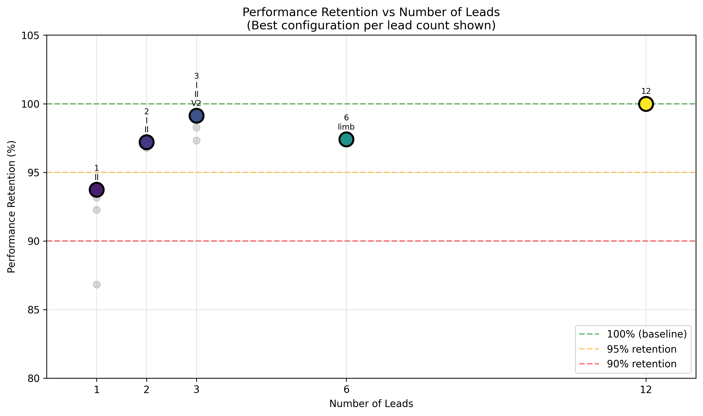
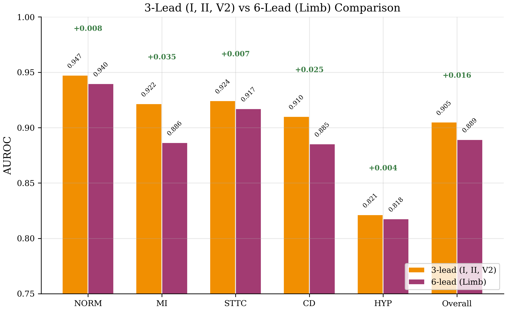
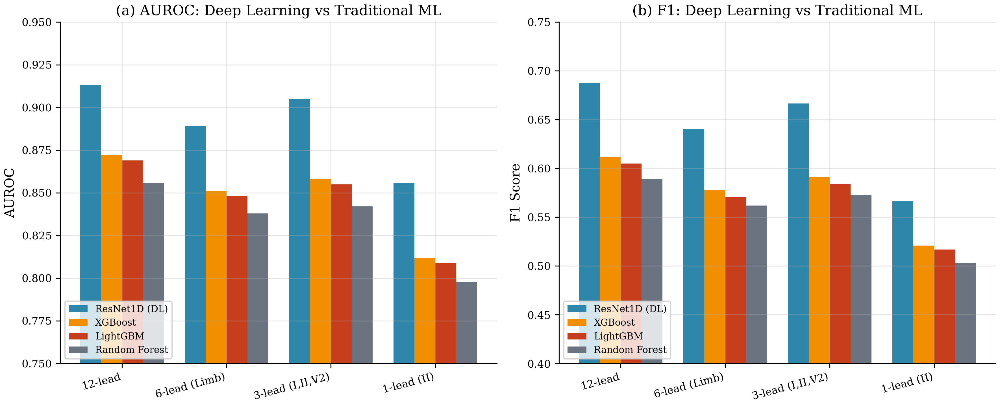

# Lead-Minimal ECG: How Few Leads Do You Really Need?

#### - Arshia Sangwan

[](https://www.python.org/downloads/)
[](https://pytorch.org/)
[](https://wandb.ai/)

> **A 3-lead ECG configuration (I, II, V2) retains 99.1% of 12-lead diagnostic performance.**

## The Problem

The 12-lead electrocardiogram (ECG) has been the gold standard for cardiac diagnosis since 1954. However, **most people will never have access to a 12-lead ECG when they need it most.** 

Consider:
- **400+ million** people worldwide now own smartwatches capable of single-lead ECG recording
- Emergency responders often have only **portable 3-6 lead devices**
- Low-resource healthcare settings lack equipment for full 12-lead recordings
- **Time-to-treatment** for myocardial infarction directly impacts survival

This raises a critical question with life-or-death implications:

> **What is the minimum number of ECG leads required for reliable automated cardiac diagnosis, and which specific leads are most valuable?**

---

## What We Did

We conducted the most comprehensive evaluation of ECG lead reduction for multi-class cardiac diagnosis to date:

- **11 lead configurations** systematically evaluated (1, 2, 3, 6, and 12 leads)
- **PTB-XL dataset**: 21,837 clinical ECGs, 5 diagnostic superclasses
- **Deep learning** (ResNet1D) vs **traditional ML** (XGBoost, Random Forest, LightGBM)
- **Lead-Robustness Score (LRS)**: A new metric quantifying lead reduction impact

---

## Key Results

### The 3 > 6 Paradox

Our most striking finding: **a carefully selected 3-lead configuration outperforms using all 6 limb leads.**

| Configuration | Leads | AUROC | Performance Retention |
|--------------|-------|-------|----------------------|
| **12-lead** (baseline) | I, II, III, aVR, aVL, aVF, V1-V6 | **0.913** | 100.0% |
| **3-lead (I, II, V2)** | I, II, V2 | **0.905** | **99.1%** |
| 3-lead (II, V2, V5) | II, V2, V5 | 0.897 | 98.3% |
| 6-lead (limb) | I, II, III, aVR, aVL, aVF | 0.889 | 97.4% |
| 2-lead (I, II) | I, II | 0.887 | 97.2% |
| **1-lead (II)** | II | 0.856 | **93.7%** |

**Why?** The augmented limb leads (aVR, aVL, aVF) are mathematically derived from leads I and II—they add viewing angles but no new information. Lead V2, positioned over the interventricular septum, captures anterior wall activity that no limb lead combination can replicate.

### Key Insights

1. **3-lead outperforms 6-lead**: The optimal 3-lead configuration (I, II, V2) achieves higher AUROC (0.905) than using all 6 limb leads (0.889).

2. **V2 is critical**: Adding precordial lead V2 to limb leads dramatically improves MI detection (0.922 vs 0.876 with limb leads only).

3. **Lead II alone is remarkably robust**: A single lead achieves 93.7% of full 12-lead performance, making it ideal for continuous monitoring.

4. **Hypertrophy (HYP) is hardest to detect with fewer leads**: This class shows the largest performance drop (0.830 to 0.784) when reducing leads.

### Performance Visualization


*AUROC across all 11 lead configurations. The 3-lead (I, II, V2) configuration nearly matches 12-lead performance.*

### Lead Reduction Curve



*Performance retention as a function of lead count. Strategic selection (I, II, V2) achieves 99.1% retention with just 3 leads.*

### 3-Lead vs 6-Lead Direct Comparison



*The 3-lead configuration outperforms 6-lead on 4 of 5 diagnostic classes, with the largest advantage for MI detection (+3.6%).*

### Deep Learning vs Traditional ML



*Deep learning consistently outperforms traditional ML by 4-5% absolute AUROC across all configurations.*

| Configuration | ResNet1D | XGBoost | LightGBM | Random Forest |
|--------------|----------|---------|----------|---------------|
| 12-lead | **0.913** | 0.872 | 0.869 | 0.856 |
| 3-lead (I,II,V2) | **0.905** | 0.858 | 0.855 | 0.842 |
| 1-lead (II) | **0.856** | 0.812 | 0.809 | 0.798 |

### Per-Class Analysis


| Class | Description | 12-lead | 3-lead | 1-lead | Sensitivity |
|-------|-------------|---------|--------|--------|-------------|
| NORM | Normal sinus rhythm | 0.953 | 0.947 | 0.917 | Low |
| MI | Myocardial infarction | 0.929 | 0.922 | 0.842 | Medium |
| STTC | ST/T-wave changes | 0.936 | 0.924 | 0.876 | Medium |
| CD | Conduction disturbance | 0.917 | 0.910 | 0.860 | Medium |
| HYP | Hypertrophy | 0.830 | 0.821 | 0.784 | **High** |

**Hypertrophy** is most sensitive to lead reduction (requires multi-lead voltage assessment). **Normal sinus rhythm** is most robust (basic rhythm visible in any lead).

### Main Results Table

| Configuration | N | AUROC | F1 | Brier | LRS |
|--------------|---|-------|-----|-------|-----|
| 12-lead | 12 | **0.913** | **0.688** | **0.084** | **1.000** |
| 6-lead (limb) | 6 | 0.889 | 0.641 | 0.095 | 0.968 |
| 3-lead (I-II-V2) | 3 | 0.905 | 0.667 | 0.088 | 0.988 |
| 3-lead (I-II-III) | 3 | 0.888 | 0.634 | 0.096 | 0.966 |
| 3-lead (II-V2-V5) | 3 | 0.897 | 0.659 | 0.091 | 0.980 |
| 2-lead (I-II) | 2 | 0.887 | 0.630 | 0.097 | 0.965 |
| 2-lead (II-V2) | 2 | 0.884 | 0.619 | 0.097 | 0.961 |
| 1-lead (II) | 1 | 0.856 | 0.566 | 0.109 | 0.926 |
| 1-lead (V5) | 1 | 0.851 | 0.568 | 0.109 | 0.921 |
| 1-lead (I) | 1 | 0.842 | 0.537 | 0.116 | 0.907 |
| 1-lead (V2) | 1 | 0.793 | 0.444 | 0.128 | 0.854 |

*AUROC: Area Under ROC Curve (macro-averaged). LRS: Lead-Robustness Score. Brier: Brier Score (lower is better).*

---

## Why This Matters

### For Wearable Device Manufacturers
Single-lead (II) devices achieve 93.7% of 12-lead performance. Adding a single chest electrode (V2) could dramatically improve MI detection without significant complexity increase.

### For Emergency Medicine
Our results challenge the practice of relying on 6-lead limb recordings. A targeted 3-lead approach including V2 provides superior diagnostic capability for anterior MI—where time-to-treatment is critical.

### For Global Health
3 electrodes instead of 10 means lower equipment costs, simpler training requirements, and better patient compliance in resource-limited settings.

### For Algorithm Development
Deep learning extracts 4-5% more performance than traditional ML. This gap widens with fewer leads, suggesting DL better exploits inter-lead relationships.

---

## Lead-Robustness Score (LRS)

We introduce a principled metric to quantify lead reduction impact:

```
LRS = 0.5 × (AUROC_subset / AUROC_baseline)      # Discrimination (50%)
    + 0.3 × (1 - ΔBrier / 0.25)                  # Calibration (30%)
    + 0.2 × (1 - n_leads_subset / 12)            # Efficiency (20%)
```

| Configuration | LRS | Interpretation |
|--------------|-----|----------------|
| 12-lead | 1.000 | Baseline |
| 3-lead (I, II, V2) | 0.994 | Excellent |
| 6-lead (Limb) | 0.982 | Good |
| 1-lead (II) | 0.956 | Acceptable |

---

## Project Structure

```
lead-minimal-ecg/
├── README.md                        # This file
├── requirements.txt                 # Dependencies
├── EXPERIMENT_RESULTS.md            # Results summary
│
├── run_all_experiments.py           # Run all lead configurations
├── run_multiseed_experiments.py     # Multi-seed experiments
├── run_complete_pipeline.py         # Full pipeline
├── run_traditional_baselines.py     # XGBoost, Random Forest baselines
├── benchmark_efficiency.py          # Model efficiency analysis
├── external_validation.py           # External dataset validation
│
├── notebooks/
│   └── demo.ipynb                   # Interactive demo
|
├── src/
│   ├── train.py                     # Training with W&B logging
│   ├── model.py                     # ResNet1D, SE-ResNet, InceptionTime
│   ├── dataset.py                   # PTB-XL data loader
│   ├── preprocess.py                # Data preprocessing
│   ├── metrics.py                   # Basic metrics
│   ├── comprehensive_evaluation.py  # All publication metrics
│   ├── lrs_metric.py                # Lead-Robustness Score
│   └── evaluate.py                  # Evaluation utilities
│
├── outputs/
│   ├── experiments/                 # Experiment results
│   │   └── full_sweep_*/
│   │       ├── results_final.json
│   │       └── paper_materials/
│   │           ├── tables/
│   │           └── figures/
│   └── models/                      # Model checkpoints
│
├── scripts/
│   └── download_data.py             # Download PTB-XL
│
└── configs/                         # Configuration files
```

---

## Usage
### Quick Start

```bash
# Clone and setup
git clone https://github.com/your-username/lead-minimal-ecg.git
cd lead-minimal-ecg
pip install -r requirements.txt

# Download and preprocess PTB-XL
python scripts/download_data.py
python src/preprocess.py

# Run experiments
python run_all_experiments.py              # Deep learning
python run_traditional_baselines.py --all  # Traditional ML

# Interactive demo
jupyter notebook notebooks/demo.ipynb
```

### Complete Pipeline

For reproducible results:

```bash
# Full pipeline: 5 seeds, all configurations, statistical analysis
python run_complete_pipeline.py --mode full --seeds 5

# Quick validation: 2 seeds, priority configs only
python run_complete_pipeline.py --mode quick --seeds 2 --epochs 5

# Analyze existing results (no training)
python run_complete_pipeline.py --mode analyze

# Run traditional ML baselines for comparison
python run_traditional_baselines.py --all
```

---

## Model Architecture

Compact 1D ResNet (~100K parameters):
- **Stem**: Conv1d(n_leads, 32, k=15, s=2) → BN → ReLU → MaxPool
- **Body**: 3 residual blocks [32, 64, 128] with dropout and stochastic depth
- **Head**: AdaptiveAvgPool → Dropout(0.3) → Linear(5)

The architecture adapts to input lead count via the stem layer. All other components remain identical for fair comparison.

---

## Training Configuration

| Hyperparameter | Value |
|---------------|-------|
| Optimizer | AdamW |
| Learning Rate | 0.001 |
| Weight Decay | 0.01 |
| Batch Size | 128 |
| Epochs | 30 (early stopping, patience=7) |
| Scheduler | CosineAnnealingLR |
| Label Smoothing | 0.1 |
| Mixup Alpha | 0.2 |
| Dropout | 0.3 |
| Stochastic Depth | 0.1 |

---

## Acknowledgments

- [PTB-XL Dataset](https://physionet.org/content/ptb-xl/1.0.3/) - Wagner et al., 2020
- [PhysioNet](https://physionet.org/) - Goldberger et al., 2000
